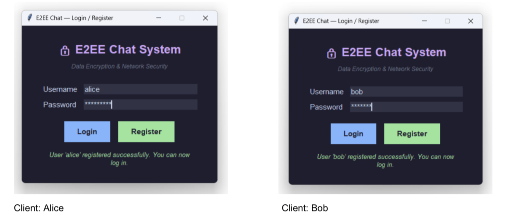
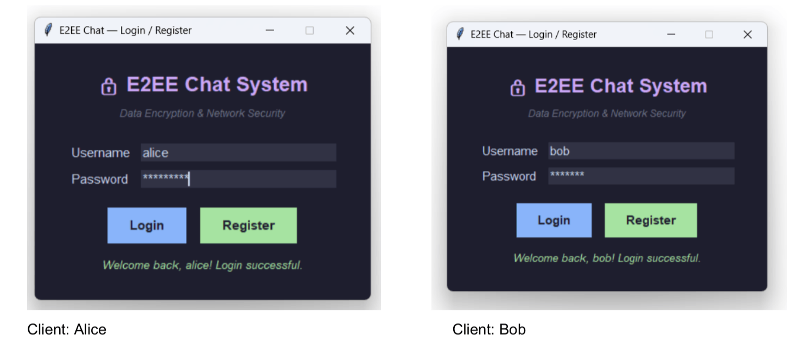
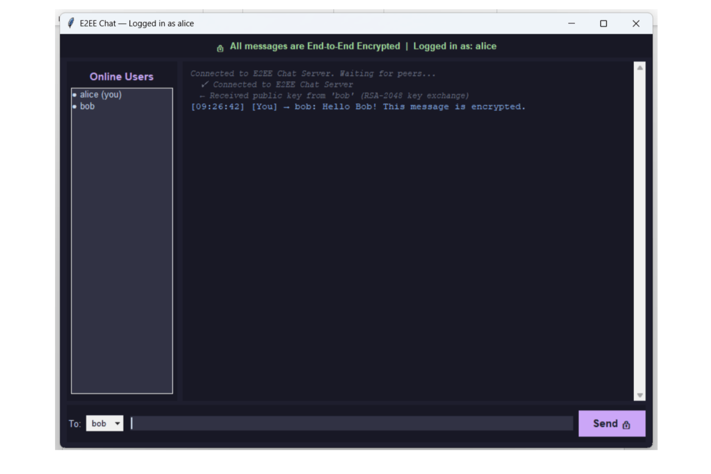
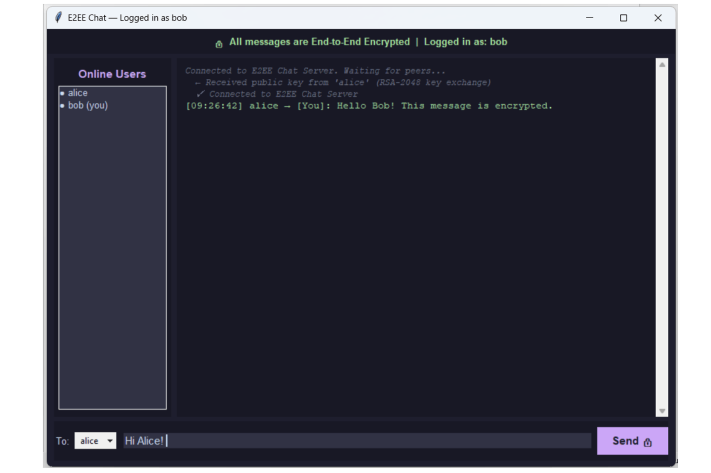
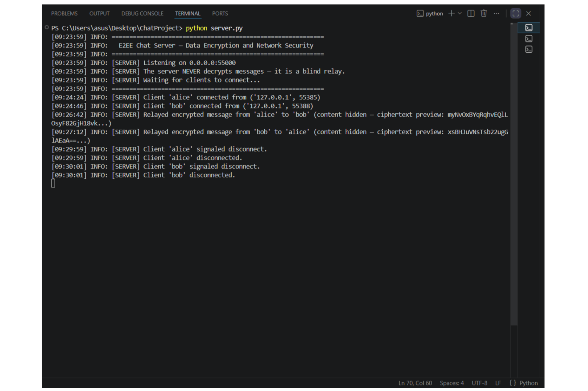
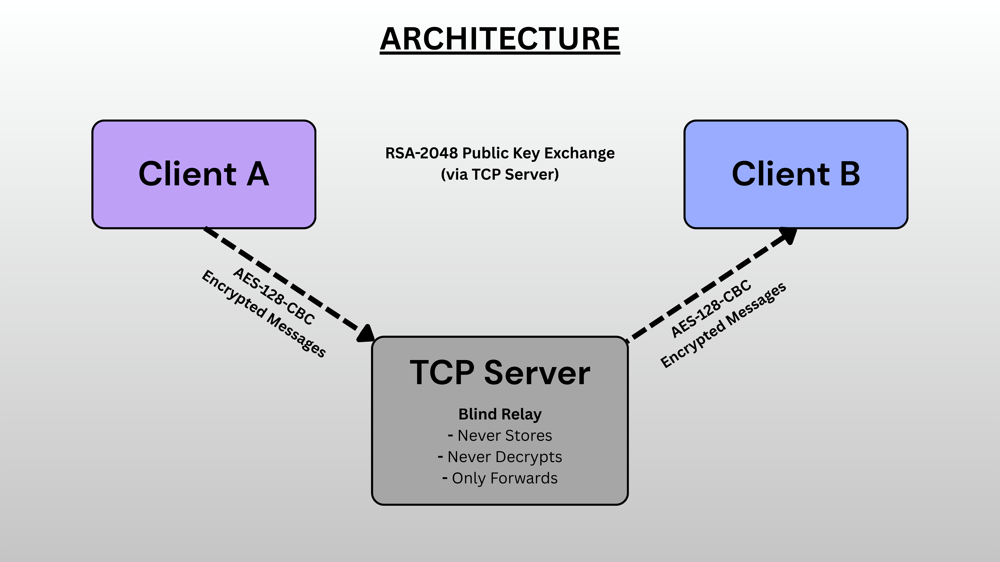

# 🔐 Secure End-to-End Encrypted (E2EE) Chat System

A secure multi-client chat application developed in Python that implements **End-to-End Encryption (E2EE)** using hybrid cryptography. The application uses **RSA-2048** for secure key exchange and **AES-128-CBC** for encrypting messages, ensuring confidential communication between clients.

---

## Features

- 🔒 End-to-End Encrypted Messaging
- 🔑 RSA-2048 Secure Key Exchange
- 🔐 AES-128-CBC Message Encryption
- 👤 Secure User Authentication
- 💬 Multi-client Real-time Communication
- 🖥️ Graphical User Interface (Tkinter)
- 🌐 TCP Socket Programming

---

## Technologies Used

- Python
- RSA-2048
- AES-128-CBC
- SHA-256
- TCP Sockets
- Tkinter
- PyCryptodome

---

## Project Structure

```text
secure-e2ee-chat-system/
│
├── auth.py              # User authentication
├── client.py            # Client application
├── crypto_utils.py      # Cryptographic functions
├── server.py            # Server application
├── requirements.txt
├── README.md
├── LICENSE
└── .gitignore
```

---

## Installation

Clone the repository

```bash
git clone https://github.com/sub703/secure-e2ee-chat-system.git
```

Install the required package

```bash
pip install -r requirements.txt
```

---

## Running the Project

Start the server

```bash
python server.py
```

Run the client

```bash
python client.py
```

---

## Security Features

- RSA-2048 for secure key exchange
- AES-128-CBC for symmetric encryption
- SHA-256 password hashing
- End-to-End encrypted communication
- Secure client-server authentication

---

## Screenshots

### Register Screen



### Login Screen



### Sender Chat Window



### Recipient Chat Window



### Server Terminal



---

## 📄 Technical Documentation

A comprehensive technical report covering the system architecture, hybrid encryption workflow, implementation details, cryptographic concepts, testing, screenshots, and future enhancements.

📥 **Download the full documentation here:**

[Secure_E2EE_Chat_System_Technical_Documentation.pdf](Secure_E2EE_Chat_System_Technical_Documentation.pdf)

---

## 🏗️ Architecture

The application follows a client-server architecture in which the TCP server functions solely as a blind relay. Clients exchange RSA-2048 public keys through the server and encrypt all messages locally using AES-128-CBC before transmission. The server only forwards encrypted traffic and never decrypts or stores message contents.



---

## Future Improvements

- File sharing
- Group chat
- Voice communication
- Message history
- Cross-platform deployment

---

## Author

**sub703**

